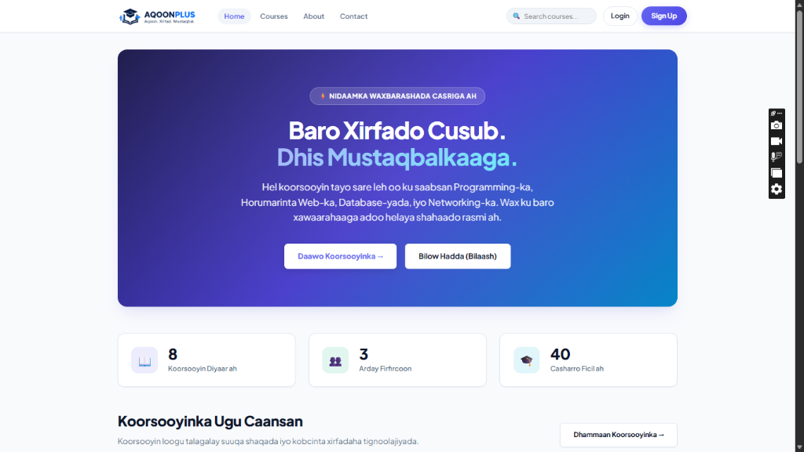

# <div align="center">
  <br>
  <strong>Aqoon. Xirfad. Mustaqbal.</strong>
  <br><br>
  <h1>AQOONPLUS Academy — Barashada Casriga ah ee Online-ka</h1>
  <p><strong>Nidaam Dhammaystiran oo Waxbarasho Online ah (Full-Stack E-Learning Management System) oo loogu talagalay Jaamacadaha iyo Kulliyadaha Soomaaliyeed.</strong></p>

  <p>
    
    
    
    
    
    
  </p>
</div>

---

<div align="center">
  
  <p><em>Shaashadda Koowaad ee AQOONPLUS Academy (Interactive Hero, Toos u Raadinta Koorsooyinka, & Tirakoobka Nidaamka)</em></p>
</div>

---

## 📌 Guudmar ku Saabsan Mashruuca (Project Overview)

**AQOONPLUS Academy** waa madal waxbarasho online ah oo casri ah (Full-Stack E-Learning Management System) oo loogu talagalay ardayda wax ka barata jaamacadaha iyo dugsiyada sare ee dalka. Nidaamku wuxuu bixiyaa jawi waxbarasho oo dhammaystiran oo ku baxa **Af-Soomaali**, fududeynaya qaadashada casharrada, imtixaannada tooska ah, iyo qaadashada shahaadooyin rasmi ah oo la xaqiijin karo.

- **Madaxa Waxbarashada (Instructor)**: **Eng. Abdikadir Kosar**
- **Horumariyaha Nidaamka (Developer)**: **Dev. Abdikadir**

> ⚡ **Falsafadda Naqshadda (Architecture Design)**: Nidaamkan waxaa lagu dhisay **Pure Vanilla Stack** (Python/Django, HTML5, CSS3, iyo Vanilla JavaScript). Looma baahsan habab culus (no Bootstrap, Tailwind, React, ama jQuery) si nidaamku u noqdo mid xawaare sare ku shaqeeya, si sahlan loo daalacan karo taleefannada iyo kombiyuutarada labadaba, isla markaana nadiif u ah bandhigyada tacliimeed.

---

## 🌟 Tilmaamaha & Faa'iidooyinka Muhiimka ah (Key Features)

### 1. 🎓 Barxadda Ardayda (Student Learning Experience)
- **Bogga Hore ee Casriga ah**: Qayb hero oo soo jiidasho leh, tirakoobka ardayda iyo koorsooyinka, iyo koorsooyinka loogu jecelyahay.
- **Katalogga Koorsooyinka & Raadin Toos ah (Live Search)**: Raadinta koorsooyinka xawaare ku socota iyo kala shaandhaynta qaybaha (Categories) oo lagu dhisay Vanilla JS.
- **Daawashada Casharrada (Sequential Lesson Player)**: Qaab habaysan oo casharba casharka xiga loo maro (Previous / Next), xiriirrada fiidiyowyada casharka, iyo calaamadaynta casharka la dhammeeyay.
- **Dashboard-ka Ardayga**: Warbixin toos ah oo ku saabsan koorsooyinka aad iska diiwaangelisay, boqolkiiba inta aad dhammaysay (%), iyo shahaadooyinkaaga.

---

### 2. 🧠 Imtixaannada Tooska ah (Interactive Quiz Engine)
- Imtixaanno gaar u ah koorso kasta oo leh su'aalo doorasho ah (Multiple Choice Questions).
- **Sixid Toos ah (Instant Auto-Grading)**: Isla marka aad gudbiso, hel dhibcahaaga, natiijada (Gudbay / Dhacay), iyo dib-u-eegista su'aalaha.
- **Diiwaanka Isku-dayada**: Taariikhda imtixaannadii hore oo dhammaystiran.

---

### 3. 🏆 Shahaadooyinka Rasmiga ah & Nidaamka Darajooyinka (Honors System)
- **Shahaado Toos ah (Digital Certificate)**: Ardaygu markuu koorsada iyo imtixaanka ku baaso, si toos ah ayuu u helayaa shahaado qurux badan.
- **Darajooyinka Guusha (Honors Badges)**:
  - 🏆 **HEER SARE (With Distinction)** — Dhibco 90% ama ka badan (Calaamad Dahab ah)
  - 🎖️ **DARAJADA 1-AAD (With Merit)** — Dhibco 80% – 89% (Calaamad Buluug ah)
  - ⭐ **GUUL (Satisfactory Pass)** — Dhibco 70% – 79% (Calaamad Cagaar ah)
- **Astaamaha Shahaadada**: Shaabad dahab ah oo 3D ah, Astaanta rasmiga ah ee AQOONPLUS (`logo-emblem.jpg`), iyo saxiixa macallinka.
- **Xaqiijinta Shahaadada (Public Verification Page)**: Qof kasta wuxuu shahaadada ku xaqiijin karaa link toos ah (`/certificate/verify/<code>/`), sidoo kale waxaa ku jira batoon loogu wadaago **LinkedIn** iyo daabacaad toos ah (**Print to PDF**).

---

### 4. 💳 Iibsiga Koorsooyinka & Ansixinta Admin-ka (Purchase & Approval Workflow)
- **Koorsooyin Bilaash ah & Kuwo Lacag ah**: Koorsooyinka waxaa loogu talagalay labo nooc: **Bilaash (Free)** iyo **Lacag ($15 - $35 USD)**.
- **Lacag-bixinta Mobile Money (Zaad & e-Dahab)**:
  - 📱 **Telesom ZAAD**: `+252 63 4812030` (Eng. Abdikadir Kosar)
  - 📱 **e-Dahab**: `+252 63 4812030`
- **Foomka Xaqiijinta (Checkout)**: Ardaygu wuxuu soo galinayaa lambarka tixraaca (Transaction ID / Reference) iyo sawirka rasiidka fariinta.
- **Xaaladda Dalabka (Order Lifecycle)**:
  - ⏳ *Sugitaan (Pending Approval)*: Ardayga waxaa loo muujinayaa in dalabkiisu socdo, casharraduna xiran yihiin.
  - ✅ *Fasaxan (Approved)*: Admin-ka ayaa hal gujin ku fasaxaya, koorsadiina isla markiiba way furmaysaa.
  - ❌ *La Diiday (Rejected)*: Haddii lacagtu khaldanto oo leh sharaxaad.
- **🎁 Hordhac Bilaash ah (Free Preview Lessons)**: Casharka koowaad ee koorsooyinka lacagta ah waa mid u furan arday kasta si uu u arko tayada casharrada inta uusan iibsan.

---

### 5. 🔔 Nidaamka Ogeysiisyada (In-App Notification Bell System)
- Gambaleel casri ah oo navbar-ka ku yaalla (🔔) oo wata calaamad guduudan oo muujinaysa tirada ogeysiisyada aan la akhriyin.
- Ogeysiis toos ah marka admin-ku dalabkaaga koorsada fasaxo ama diido.
- Bog u gaar ah ogeysiisyada (`/notifications/`) oo leh taariikhda iyo batoonka *"Dhammaan u calaamadee in la akhriyay"*.

---

### 6. 💬 Wadahadalka & Su'aalaha Casharka (Lesson Q&A Discussion Board)
- Cashar kasta hoostiisa waxaa ku yaalla barxad wada-hadal oo ardaydu su'aalo ku weydiin karaan.
- Macallin **Eng. Abdikadir Kosar** wuxuu toos ugu jawaabi karaa ardayda isagoo wata calaamadda gaarka ah ee `👨‍🏫 Macallinka (Instructor)`.

---

### 7. 📎 Qalabka & Faylasha Casharka (Lesson Resources)
- Macallinku wuxuu cashar kasta ku lifaaqi karaa PDF files, code files, ama linkiyo dheeraad ah oo ardaydu toos u soo degsan karaan.

---

### 4. 🔐 Nidaamka Amniga & Gelitaanka (Advanced Authentication)
- **Gelitaan Labo Dhinac ah**: Waxaad ku geli kartaa **Email-kaaga AMA Username-kaaga**.
- **I Xasuuso (Remember Me)**: Xulasho kuu oggolaanaysa in akoonkaagu furnaado ilaa 2 toddobaad.
- **Muuji / Qari Furaha (👁️ / 🙈 Show/Hide Toggle)**: Fursad lagu arko furaha sirta ah xilliga qorista.
- **Cabbiraadda Awoodda Furaha (Password Strength Meter)**: Xariiq midabaysan oo toos u cabbiraysa adkaanta furaha sirta ah.
- **Ilowday Furahaaga (4-Step Password Reset Workflow)**:
  1. *Codsi*: Geli email-kaaga ama magacaaga isticmaale.
  2. *Email & Token*: Waxaa la soo dirayaa token amni ah oo Django cryptographic ku dhisay.
  3. *Dejinta Furaha Cusub*: Foom leh cabbirka awoodda furaha.
  4. *Guul*: Xaqiijin iyo toos u galitaanka akoonkaaga.
- **Beddelka Furaha (Profile Password Change)**: Beddelashada furaha sirta ah adoo ku jira gudaha profile-ka.

---

### 5. 👑 Xafiiska Maamulka (Custom Admin Panel)
- Ka sokow Django admin-ka rasmiga ah, nidaamku wuxuu leeyahay **Admin Panel u gaar ah** oo ku salaysan midabada iyo astaanta AQOONPLUS:
  - Maamulka Isticmaalayaasha & Kaalmaha (Admin / Student)
  - Abuurista iyo wax-ka-beddelka Koorsooyinka & Casharrada
  - Maamulka Su'aalaha iyo Imtixaannada
  - Tirakoobka Diiwaangelinta & Xogta Shahaadooyinka

---

### 6. 🌐 Bogagga Xogta & Xiriirka
- **Nagu Saabsan (About Us)**: Hadafka, aragtida, iyo xogta macallimiinta AQOONPLUS.
- **Nala Soo Xiriir (Contact Us)**: Foom toos ah oo fariin loogu diro maamulka iyo xafiiska taageerada.

---

## 🛠️ Qalabka & Farsamooyinka Lagu Dhisay (Technology Stack)

| Qaybta | Qalabka / Luqadda | Faahfaahin |
|---|---|---|
| **Backend Framework** | **Django 5.2 (Python 3.14)** | Models, ORM, Forms, Views, Authentication, Cryptographic Tokens |
| **Database** | **SQLite3** | Keydka xogta ee fudud, degdegga ah, laguna shaqeyn karo meel kasta |
| **Frontend Layout** | **HTML5 Semantic** | Qoraalka bogagga oo habaysan oo heer caalami ah |
| **Styling & Design** | **Vanilla CSS3** | Custom CSS Variables, Flexbox, Grid, Keyframe Animations (No frameworks) |
| **Client Scripts** | **Vanilla JavaScript (ES6+)** | Dynamic Search, Password Toggles, Strength Checker, Mobile Drawer |
| **Testing** | **Django Test Runner** | 17 Automated Unit & Integration Tests (100% Passing) |

---

## 📁 Qaab-dhismeedka Faylasha (Project Directory Structure)

```
django/
├── manage.py
├── requirements.txt
├── README.md
├── db.sqlite3
│
├── e_learning/               # Habeynta Guud ee Mashruuca (Settings & Root URLs)
│   ├── settings.py
│   ├── urls.py
│   ├── wsgi.py
│   └── asgi.py
│
├── accounts/                 # Akoonnada, Amniga, & Dib-u-dejinta Furaha
│   ├── forms.py              # Register, Login, Reset, & Change Password Forms
│   ├── models.py             # UserProfile (Role: Student / Admin, Bio, Avatar)
│   ├── urls.py               # Auth URLs (Login, Register, Reset flow)
│   ├── views.py              # Logic-ga Gelitaanka & Dib-u-dejinta
│   ├── tests.py              # Tijaabooyinka Akoonnada
│   └── templates/accounts/   # login, register, profile, password_reset...
│
├── courses/                  # Koorsooyinka, Casharrada, Imtixaanka & Shahaadada
│   ├── forms.py              # ReviewForm & Contact Form
│   ├── models.py             # Course, Lesson, Enrollment, Quiz, Question, Choice, Certificate
│   ├── urls.py               # Course, Lesson, Quiz, Cert verify, About, Contact
│   ├── views.py              # Waxbarashada, Imtixaanka, Shahaado bixinta & Darajooyinka
│   ├── tests.py              # Tijaabooyinka Koorsooyinka
│   └── templates/courses/    # home, course_detail, lesson_detail, quiz, certificate...
│
├── dashboard/                # Xogta Gaarka ah ee Ardayga
│   ├── views.py              # Tirakoobka horumarka ardayga
│   ├── urls.py
│   ├── tests.py
│   └── templates/dashboard/  # dashboard.html
│
├── admin_panel/              # Qaybta Gaarka ah ee Maamulka (Custom Dashboard)
│   ├── views.py
│   ├── urls.py
│   └── templates/admin_panel/
│
├── templates/                # Qaababka Guud ee la wadaago
│   ├── base.html             # Navbar, Footer, Mobile Drawer & Global Messages
│   ├── 404.html              # Bogga Khaladka 404
│   └── 500.html              # Bogga Khaladka 500
│
└── static/                   # Faylasha Naqshadda & Sawirrada
    ├── css/style.css         # Naqshadda Buuxda ee AQOONPLUS
    ├── js/main.js            # JavaScript-ka Nidaamka
    └── images/               # Astaamaha Rasmiga ah (logo-header, logo-emblem, screenshots)
```

---

## 🚀 Tallaabooyinka Ku Rakibashada (Setup & Installation)

### 1. Soo Degso Mashruuca (Clone Repository)
```bash
git clone https://github.com/Abdikadirkosar/django-elearning.git
cd django-elearning
```

### 2. Sameyso Deegaan Gooni ah (Virtual Environment)
```powershell
# Windows PowerShell
python -m venv .venv
.venv\Scripts\Activate.ps1
```

### 3. Ku Shubo Baahiyaha Mashruuca (Install Dependencies)
```bash
pip install -r requirements.txt
```

### 4. Furi Xog-keydiyaha (Run Migrations)
```bash
python manage.py makemigrations
python manage.py migrate
```

### 5. Geli Xogta Tusaalaha ah (Seed Sample Courses & Lessons)
```bash
python manage.py seed_data
```

### 6. Sameyso Akoonka Maamulaha (Superuser)
```bash
python manage.py createsuperuser
```

### 7. Kici Server-ka (Start Development Server)
```bash
python manage.py runserver 8000
```

Ku fur browser-kaaga:
- 🌐 **Bogga Guud**: [http://127.0.0.1:8000/](http://127.0.0.1:8000/)
- 👑 **Admin Panel-ka**: [http://127.0.0.1:8000/admin-panel/](http://127.0.0.1:8000/admin-panel/)
- ⚙️ **Django Admin**: [http://127.0.0.1:8000/admin/](http://127.0.0.1:8000/admin/)

---

## 🧪 Tijaabooyinka Tooska ah (Automated Test Suite)

Mashruucani wuxuu leeyahay **19 tijaabo oo toos ah** kuwaas oo xaqiijiya badqabka dhammaan qaybaha muhiimka ah:

```bash
python manage.py test
```

### Natiijada Tijaabooyinka:
```text
Found 19 test(s).
Creating test database for alias 'default'...
System check identified no issues (0 silenced).
...................
----------------------------------------------------------------------
Ran 19 tests in 121.800s

OK
```

| Qaybta | Tijaabada | Natiijada |
|---|---|---|
| `accounts` | `test_login_logout` | ✅ Guul |
| `accounts` | `test_login_with_email` | ✅ Guul |
| `accounts` | `test_password_reset_request_and_confirm` | ✅ Guul |
| `accounts` | `test_profile_view_get_and_update` | ✅ Guul |
| `accounts` | `test_registration_password_mismatch` | ✅ Guul |
| `accounts` | `test_registration_success` | ✅ Guul |
| `accounts` | `test_user_profile_auto_created` | ✅ Guul |
| `courses` | `test_course_detail_status` | ✅ Guul |
| `courses` | `test_course_list_status` | ✅ Guul |
| `courses` | `test_course_properties` | ✅ Guul |
| `courses` | `test_enrollment_workflow_free_course` | ✅ Guul |
| `courses` | `test_paid_course_checkout_and_admin_approval` | ✅ Guul |
| `courses` | `test_free_preview_access` | ✅ Guul |
| `courses` | `test_home_page_status` | ✅ Guul |
| `courses` | `test_lesson_completion` | ✅ Guul |
| `courses` | `test_quiz_and_certificate` | ✅ Guul |
| `courses` | `test_submit_review` | ✅ Guul |
| `dashboard` | `test_dashboard_authenticated_success` | ✅ Guul |
| `dashboard` | `test_dashboard_unauthenticated_redirect` | ✅ Guul |

---

## 📍 Xarunta & Xiriirka Rasmiga ah (Official Headquarters & Contact)

* 📍 **Xarunta Guud**: Arabsiyo, Somaliland *(Online Learning Campus & Tech Hub)*
* 📧 **Email**: [Abdikadirkosara@gmail.com](mailto:Abdikadirkosara@gmail.com) | [contact@aqoonplus.so](mailto:contact@aqoonplus.so)
* 📞 **Telefoon & WhatsApp**: [+252 634812030](tel:+252634812030) *(Isniin - Sabti: 8:00 AM - 6:00 PM)*
* 💬 **Toos WhatsApp**: [https://wa.me/252634812030](https://wa.me/252634812030)

---

## 👨‍💻 Xogta Qorayaasha & Xuquuqda (Credits & Leadership)

* 🎓 **Madaxa & Bare Sare**: **Eng. Abdikadir Kosar**
* 💻 **Injineerka & Dhisaha Nidaamka**: **Dev. Abdikadir**
* 🏫 **Astaanta**: **AQOONPLUS Academy** — *Aqoon. Xirfad. Mustaqbal.*

---

<div align="center">
  <sub>Waxaa si gaar ah loogu dhisay horumarinta aqoonta dhalinyarada Soomaaliyeed ❤️</sub>
</div>

